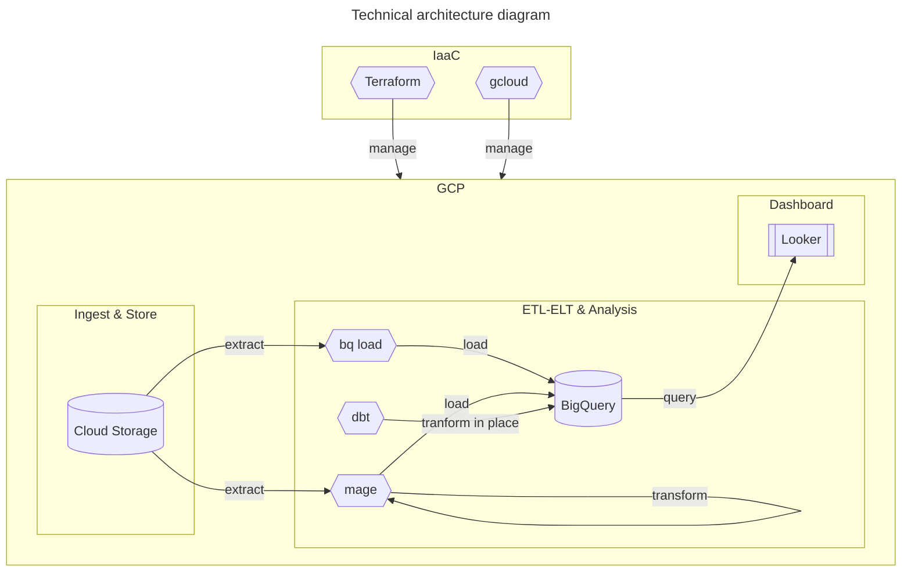
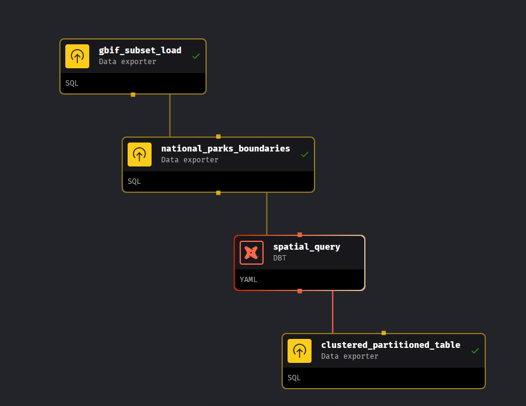
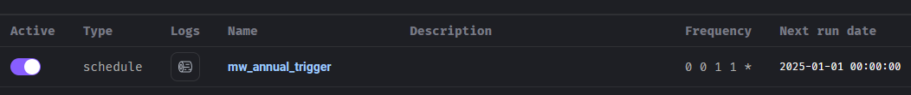

# Cougar (_Puma concolor_) occurences tracker

A data pipeline that use `dbt`, `mage`, `Terraform` and `GCP`

## Overview

### Purpose

The aim of this project is to build a dashboard to track the occurrences (i.e. human sightings) of Cougar (_Puma concolor_) over several years and over few Southwestern states of the United States and their National Parks

> [!NOTE]
> Southwestern states selection for this project : `Colorado`, `Arizona`, `Texas`, `California`, `New mexico`, `Utah` and `Nevada`

### Process

The data is ingested through a batch job on a monthly basis orchestrated through `Mage`. The main dataset is based on a copy of a public dataset of `BigQuery`. Once everything is set up, data is transformed via `dbt` into a clean timeseries table which is then used to create the dashboard.

> [!IMPORTANT]
> The main dataset could be ingested on a monthly basis, but as this type of species occurrence data is slowly updated, we prefer to do it on an annual basis in order to save resources. 

> [!NOTE]
> The main dataset could also be enriched by other informations that will be first ingested into a data lake (`GCS`), and loaded to `BigQuery`, such as US National Parks Boundaries, to make tracking of the occurences that occur is those parks

### Dataset

- Main dataset: [GBIF Species Occurrences](https://console.cloud.google.com/marketplace/product/bigquery-public-data/gbif-occurrence) (BigQuery Public Data), more than 2 billions of records
- Additional dataset: List of the southern state of United State
- Additional dataset: 


## Technical Description

### Tools and technologies

- Cloud - Google Cloud Platform
- IaaC - Terraform
- Containerization - Docker
- Orchestration - Mage
- Transformation - dbt (bundled in mage)
- Data Lake - Google Cloud Storage
- Data Warehouse - BigQuery
- Data Visualization - Looker (or alternatively Apache Superset)

### Architecture





## Run this project from scratch

### Requirements

> [!NOTE] 
> You need to have Google Cloud SDK and Terraform installed on your local machine

Run those commands to be sure everything needed is running

```sh
gcloud --version
terraform --version
```

Connect to Google Cloud by doing :

```sh
gcloud init
```

### Create a project on GCP

```sh
## Set a project name
export PROJECT_NAME=monkey-wrench
## create a new project
gcloud projects create --name $PROJECT_NAME
## retrieve the project identifier
export PROJECT_ID=$(gcloud projects list --filter='name:'$PROJECT_NAME --format 'get(project_id)')
## set project as default one, using the PROJECT_ID variable
gcloud config set project $PROJECT_ID
```

### Configure a service account to run IaaC tools

1. Create a service account on GCP (_Google Cloud Platform_) with `gcloud`

```sh
## Retrieve project identifier using default project of gcloud (has been defined above)
export PROJECT_ID=$(gcloud config get-value project)
## Set a service account name
export SERVICE_ACCOUNT_NAME=monkey-wrench-runner-sa
gcloud iam service-accounts create $SERVICE_ACCOUNT_NAME --display-name="Monkey Wrench Service Account"
```

2. Give the service account proper permissions

```sh
gcloud projects add-iam-policy-binding $PROJECT_ID \
--member="serviceAccount:$SERVICE_ACCOUNT_NAME@$PROJECT_ID.iam.gserviceaccount.com" \
--role='roles/storage.admin'

gcloud projects add-iam-policy-binding $PROJECT_ID \
--member="serviceAccount:$SERVICE_ACCOUNT_NAME@$PROJECT_ID.iam.gserviceaccount.com" \
--role='roles/compute.admin'

gcloud projects add-iam-policy-binding $PROJECT_ID \
--member="serviceAccount:$SERVICE_ACCOUNT_NAME@$PROJECT_ID.iam.gserviceaccount.com" \
--role='roles/bigquery.admin'
```

3. Download the credential file (JSON format)

```sh
gcloud iam service-accounts keys create ./gcp/keys/mw-creds.json --iam-account $SERVICE_ACCOUNT_NAME@$PROJECT_ID.iam.gserviceaccount.com
```

### Setup a virtual machine and storage on GCP with IaaC tools

4. create a file `./terraform/secret.tfvars` to store the VM root password

> [!WARNING]
> do not commit this file !

```sh
echo 'vm_root_password = "<secret password here>" > ./terraform/secret.tfvars
```

5. Launch the creation of VM and storage through `terraform`

```sh
terraform -chdir=terraform init
# review the terraform plan
terraform -chdir=terraform plan -var-file="secret.tfvars"
# apply the terraform plan
terraform -chdir=terraform apply -var-file="secret.tfvars"
```

> [!IMPORTANT]
> keep a copy of the output IP address
> e.g. : ad_ip_address = "35.247.99.54"

6. Once created, connect to the VM with `gcloud`

```sh
## Retrieve project identifier using default project of gcloud (has been defined above)
export PROJECT_ID=$(gcloud config get-value project)
gcloud compute ssh --zone "us-west1-a" "monkey-wrench-vm" --project $PROJECT_ID
```

`gcloud` will take care of creating the SSH key pair


7. (Optional) In case you need it, you can suspend or resume the VM

Suspend the VM :
```sh
gcloud compute instances suspend monkey-wrench-vm
```

Resume the VM (make it alive) :

```sh
gcloud compute instances resume monkey-wrench-vm
```

### Datalake : Setup a Google storage

`Google cloud storage bucket` have already been initialized by terraform

#### Load data in `GS`

We load a sample dataset to `GS`

```sh
gcloud storage cp data/parks-bounds.geojsonl gs://mw_bucket
```

The `geojsonl` files will be processed furthermore by `mage`

Alternatively, it is also possible to load those `geojsonl` files with `bq` CLI, but this is out of the scope of this project

```sh
bq load --source_format=NEWLINE_DELIMITED_JSON  --json_extension=GEOJSON --autodetect mw_dataset.us_national_parks gs://mw_bucket/parks-bounds.geojsonl
```

### Datawarehouse : Setup a BigQuery Dataset

0. (Optional) Create an BigQuery Dataset with `bq` CLI

> [!IMPORTANT]
> This dataset has been initialized via terraform, this command above is just for information

```sh
bq --location=europe-north1 mk \
    --dataset \
    --description="Monkey Wrench dataset" \
    mw_us_dataset
```

### Configure the virtual machine on GCP

Open a ssh session
```sh
## Retrieve project identifier using default project of gcloud (has been defined above)
export PROJECT_ID=$(gcloud config get-value project)
gcloud compute ssh --zone "us-west1-a" "monkey-wrench-vm" --project $PROJECT_ID
```

```sh
# password is the one defined in ./terraform/secret.tfvars in the stage below
su root
apt update && apt install docker.io
curl -L https://github.com/docker/compose/releases/download/v2.16.0/docker-compose-`uname -s`-`uname -m` -o /usr/local/bin/docker-compose
chmod +x ~/docker-compose

# create a local docker network
docker network create -d bridge my-bridge-network


cd ~
git clone https://github.com/scali/monkey-wrench.git
cd monkey-wrench

cat <<EOF >>.env
<<put here a copy of you .env file>>
EOF

cat <<EOF >>mw-creds.json
<<put here a copy of you ./gcp/keys/mw-creds.json file>>
EOF

# Launch mage (may take some time to download and extrat ~10min on a e2-micro or e2-medium VM)
docker-compose up -d
```

Then launch a web brower to `http://<ad_ip_address>` with the external IP of your GCP VM, provided by the terraform output `<ad_ip_address>`

> [!IMPORTANT]
> use `http` and not `https`, as we didn't dive into security here

Default login is `admin@admin.com`

> [!IMPORTANT]
> change your admin password here : http://<ad_ip_address>/settings/workspace/users/1

### Workflow orchestration : Extract, Transform, Load the data

Launch `mage`, and the pipeline named `mw_gbif_subset`

Here is a screenshot of the DAG of the pipeline :



#### Trigger / Batch Automation

The pipeline is configured to run on an annual basis



### Visualize the data